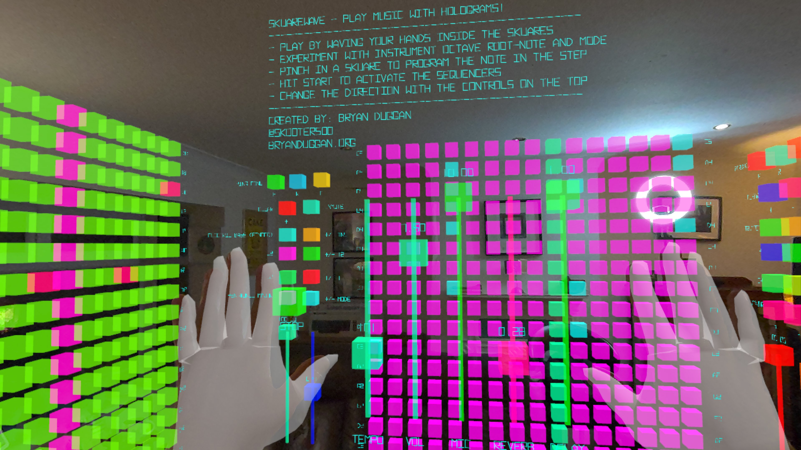
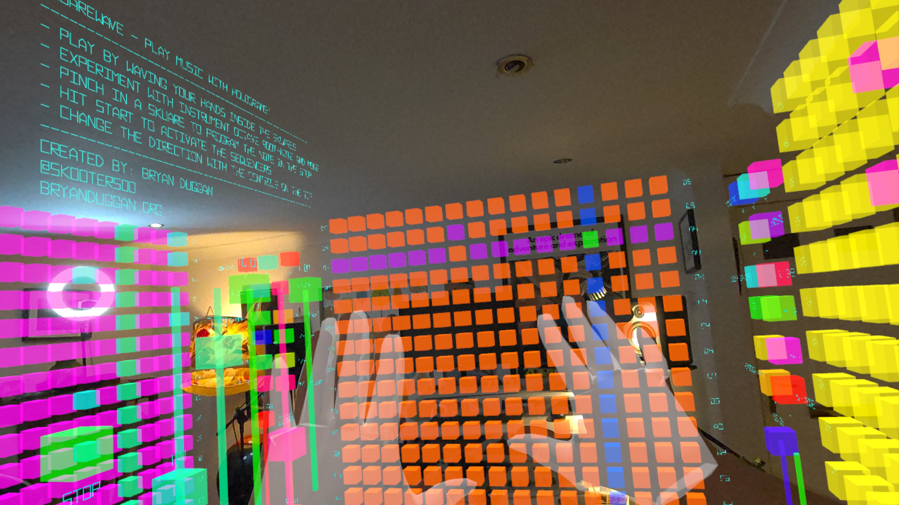
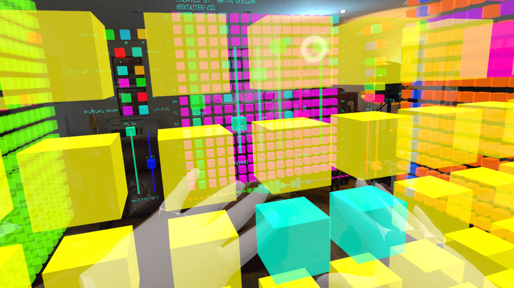
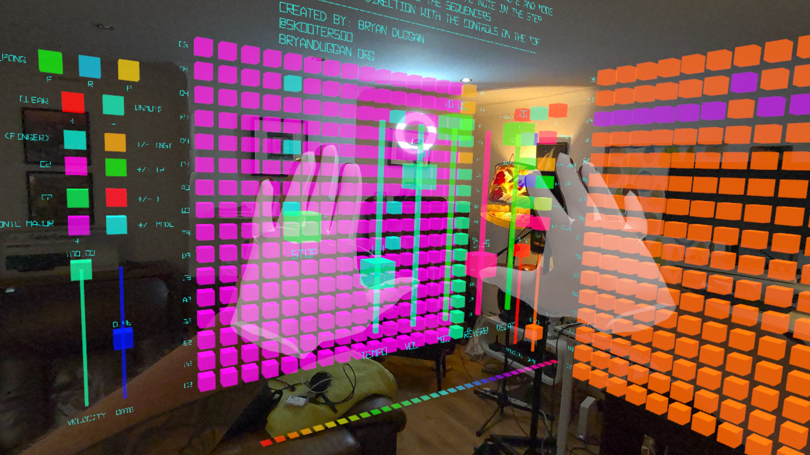
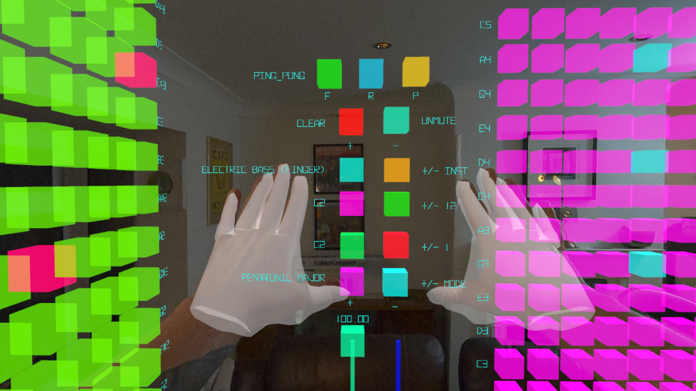

# Skuarewave - Play Music With Holograms

Skuarewave is a new type of musical instrument. Wave your hands through holographic skuares to play notes. Program beats and melodies and the sequencers. Add delay, reverb and mix in your voice. 

## Requirements

- Godot 4.6

## Quick start (editor)

1. Install **Godot 4.6.x**.
2. Open this folder as a project in Godot.
3. Ensure editor plugins are enabled (already configured in `project.godot`):
   - XR Tools
   - MIDI
4. Run the project.

### Main scene

The configured main scene is:

- `square.tscn`

## How to play

In the main scene you’ll find a pickable “instrument” object with:

- Step sequencers (16 steps) you can start/stop
- Controls to change sequencing direction
- Controls to adjust parameters like gate/velocity
- Change the key, mode and octave in real-time as the music plays 

To export:

1. In Godot: **Project → Export…**
2. Select **Android** preset.
3. Make sure your Android toolchain is set up (SDK/NDK/JDK) in the Godot editor settings.
5. Export.
